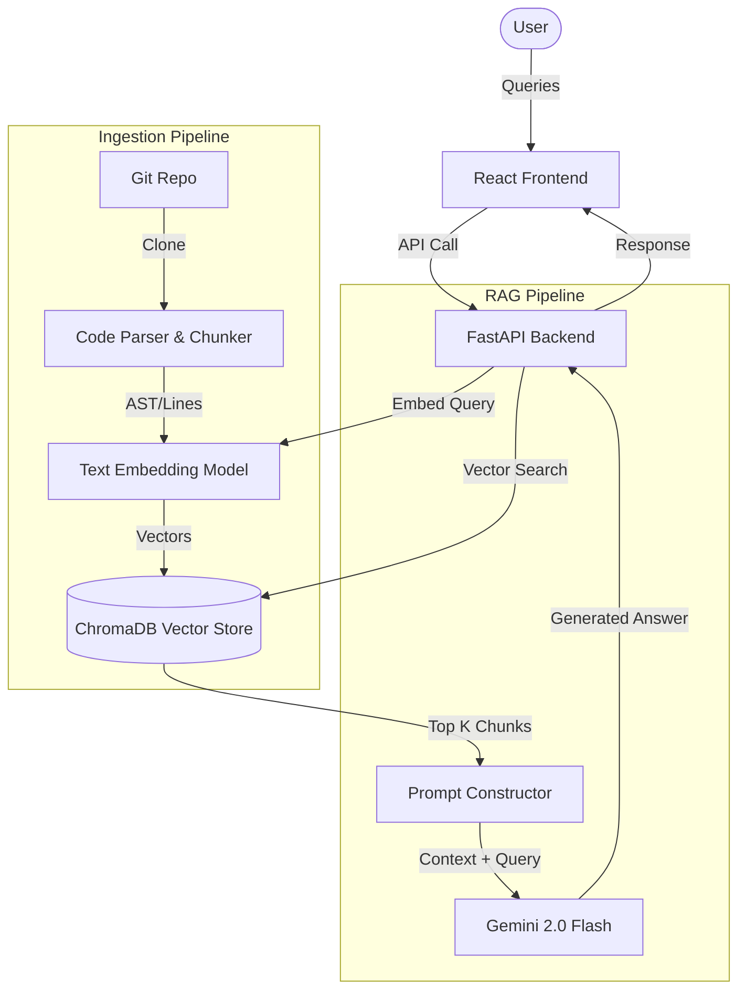

# 🔍 CodeLens — AI-Powered Codebase RAG Assistant

> Understand any codebase in seconds, not hours.

[](https://opensource.org/licenses/MIT)
[](https://www.python.org/)
[](https://nodejs.org/)

## 📋 Problem Statement
Large codebases are incredibly difficult to navigate. When developers join a new team or need to fix a bug in an unfamiliar service, they spend countless hours using `grep`, jumping through files, and tracing complex inheritance chains just to understand *where* things happen and *how* they work.

## 💡 Solution
CodeLens solves this by using Retrieval-Augmented Generation (RAG) specialized for code. It ingests your repository, chunks source files intelligently (preserving context and functions), embeddings them, and allows you to chat naturally with your codebase using Google's Gemini models.

## ✨ Key Features
- **🚀 Instant Indexing**: Process large repositories in minutes.
- **🧠 Intelligent Code Chunking**: Preserves structural integrity of functions and classes.
- **💬 Natural Language Querying**: Ask "How does authentication work?" and get precise answers with code citations.
- **🔗 Multi-File Context**: Understands workflows that span across controllers, services, and database layers.
- **🎨 Beautiful UI**: Dark-mode ready interface for easy reading of code blocks.

## 🏗️ Architecture



## 🔧 Technology Stack
| Component | Technology | Rationale |
|-----------|------------|-----------|
| **LLM** | Gemini 2.0 Flash | Blazing fast responses and massive context window for code. |
| **Embeddings** | text-embedding-004 | Highly accurate semantic representations of code blocks. |
| **Vector DB** | ChromaDB | Lightweight, open-source, and runs locally without setup. |
| **Backend** | Python / FastAPI | Best ecosystem for AI/ML and asynchronous API handling. |
| **Frontend** | React / TypeScript | Component-driven UI for rendering complex code blocks and chat. |

## 🚀 Quick Start

1. **Clone the repository**
   ```bash
   git clone https://github.com/username/codelens.git
   cd codelens
   ```

2. **Setup environment variables**
   ```bash
   cp .env.example .env
   # Edit .env and add your GOOGLE_API_KEY
   ```

3. **Start the application**
   ```bash
   docker-compose up -d
   ```
   *Alternatively, run the frontend and backend manually using npm and python.*

## 🔑 Environment Variables
See `.env.example` for a complete list of required and optional environment variables.

## 📖 Usage
1. Open `http://localhost:5173` in your browser.
2. Enter the path or URL to a git repository.
3. Wait for the indexing process to complete.
4. Start asking questions!

## ❓ Example Questions
Test the RAG assistant on our included `sample-repo` with these questions:
- "Where is authentication handled?"
- "Where is password validation implemented?"
- "Where is the login API?"
- "How does JWT validation work?"
- "Where are database connections created?"
- "How is user registration handled?"
- "Where is payment processing implemented?"

## 📸 Screenshots
*(Coming soon)*

## 🚢 Deployment
CodeLens is fully dockerized and ready to be deployed to platforms like Render, Railway, or standard VPS using Docker Compose.

## 🔮 Future Scope
- Support for generating automated documentation
- Integration with GitHub PRs to explain code changes automatically
- IDE Plugins (VSCode, JetBrains)

## 👥 Team
- **Hacker 1** - Fullstack / AI Integration
- **Hacker 2** - Backend / Vector DB
